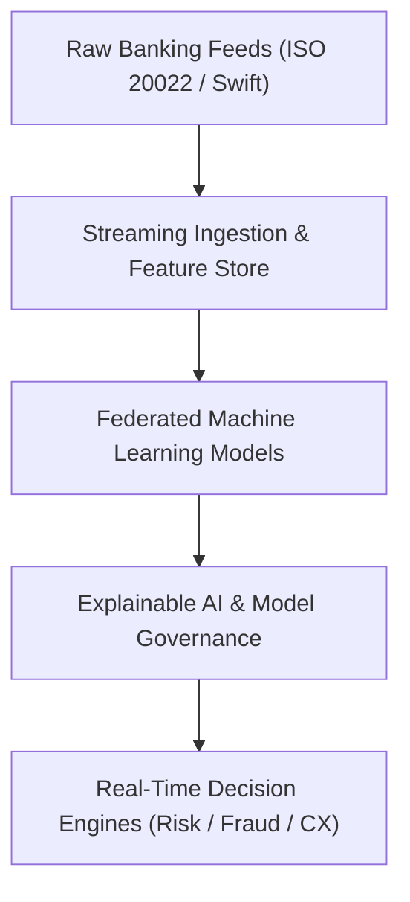

# Features & Architecture

Banking On AI bridges cutting-edge machine learning research with mission-critical financial engineering, delivering actionable intelligence across retail, commercial, and investment banking operations.

## Core Capabilities

### 1. Real-Time Fraud & Anomaly Detection
Sub-millisecond graph neural networks that identify synthetic identity fraud, money laundering velocity rings, and unauthorized account takeovers before settlement.

### 2. Algorithmic Credit & Model Risk Governance
Explainable AI (XAI) frameworks conforming to global regulatory mandates (SR 11-7, EU AI Act) for automated underwriting, credit scoring, and dynamic capital allocation.

### 3. Hyper-Personalized Wealth & Cash Flow Intelligence
Predictive time-series forecasting providing retail and commercial treasury clients with forward-looking liquidity warnings, cash-flow optimization, and automated yield sweeps.

### 4. Intelligent Automation & Natural Language Processing
Context-aware LLM agents for automated regulatory filing (IFRS/IAS, FinCEN, Basel III/IV), compliance audit trails, and conversational wealth advisory.

## Enterprise Architecture

